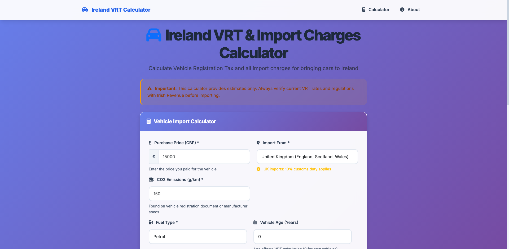
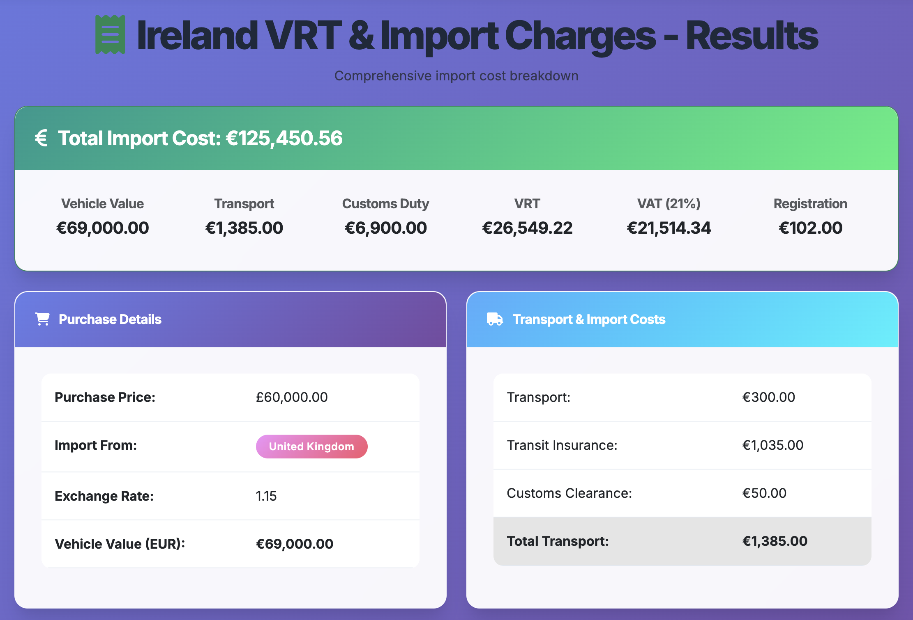
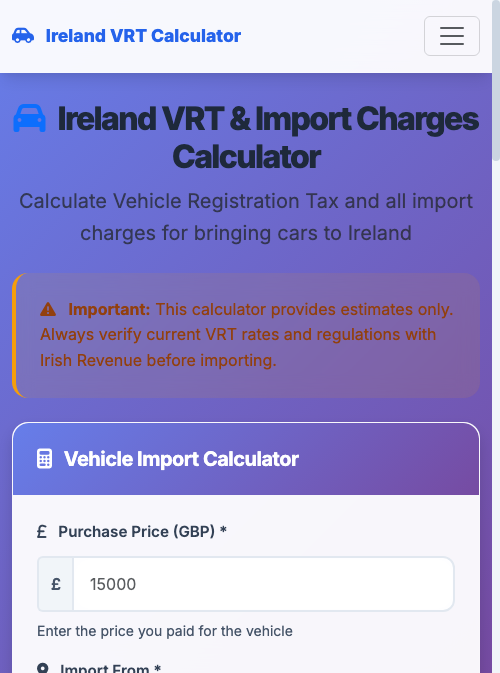
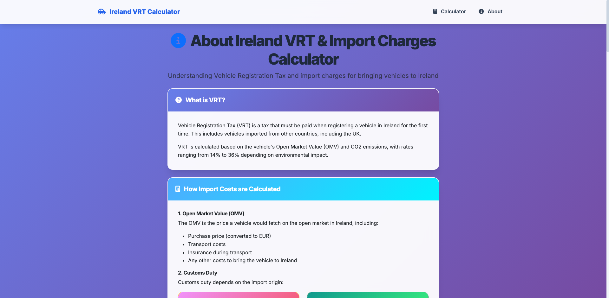

# VRT Calculator for UK to Ireland Car Imports

This project provides multiple ways to calculate Vehicle Registration Tax (VRT) for importing cars from the UK to Ireland:
- Command-line Python scripts
- **Flask web application with modern UI**

## Screenshots

### Main Calculator Interface

*Modern, responsive web interface with real-time exchange rates and comprehensive form validation*

### Calculation Results

*Detailed breakdown of all import costs including VRT, customs duty, VAT, and additional fees*

### Mobile-Responsive Design

*Fully responsive design that works seamlessly on mobile devices*

### About Page with Legal Information

*Comprehensive legal information and import requirements*

> 📸 **Screenshots Updated:** All screenshots are current as of August 2025 and reflect the latest UI design and VRT rates.

## ⚠️ Important Disclaimer

**This calculator provides estimates only!** Always verify current rates and regulations with:
- Irish Revenue (revenue.ie)
- Customs officials
- Professional import agents

VRT rates, CO2 bands, and minimum amounts change regularly.

## Files

### Command Line Tools
- `vrt_calculator.py` - Basic VRT calculator
- `vrt_calculator_enhanced.py` - Enhanced version with API integration capabilities

### Web Application
- `app.py` - Flask web application
- `run.py` - Production runner script
- `templates/` - HTML templates
- `static/` - CSS and JavaScript files
- `requirements.txt` - Python dependencies
- `DEPLOYMENT.md` - Production deployment guide

## Quick Start

### 1. Install Dependencies
```bash
pip3 install -r requirements.txt
```

### 2. Run the Application
```bash
python3 app.py
```

### 3. Open Your Browser
Navigate to `http://localhost:5000`


*Getting started with the VRT Calculator in under 30 seconds*

## Installation

```bash
pip3 install -r requirements.txt
```

## Usage

### 🌐 Web Application (Recommended)
```bash
# Run the Flask web app
python3 app.py

# Or use the production runner
python3 run.py

# Access at: http://localhost:5000
```

**Features:**
- 🎨 Modern, responsive web interface with Bootstrap styling
- 🇬🇧🇮🇪 **Import origin selection** (UK vs Northern Ireland)
- 💱 Real-time exchange rate fetching
- ✅ Interactive form validation with instant feedback
- 📊 Detailed cost breakdown with conditional customs duty
- 🖨️ Print-friendly results page
- 📱 Mobile-friendly responsive design
- 🔌 API endpoints for integration
- 🚗 Support for all fuel types (Petrol, Diesel, Electric, Hybrid)
- 📈 Updated 2024 VRT rates with 20 detailed CO2 bands

### Command Line Tools

#### Basic Calculator
```bash
python3 vrt_calculator.py
```

#### Enhanced Calculator
```bash
python3 vrt_calculator_enhanced.py
```

## What the Calculator Includes

### VRT Calculation
- CO2-based VRT rates (7% to 41%)
- Minimum VRT amounts by CO2 emissions
- Age-related depreciation
- Open Market Value (OMV) calculation

### Additional Costs Estimated
- Transport costs (ferry/driving)
- Transit insurance
- Customs clearance fees
- Motor tax estimates
- Registration fees

### Current VRT Rates (2024 - Category A)

| CO2 Emissions (g/km) | VRT Rate | Minimum Amount |
|---------------------|----------|----------------|
| 0-50 | 7% | €140 |
| 51-80 | 9% | €180 |
| 81-85 | 9.75% | €195 |
| 86-90 | 10.5% | €210 |
| 91-95 | 11.25% | €225 |
| 96-100 | 12% | €240 |
| 101-105 | 12.75% | €255 |
| 106-110 | 13.5% | €270 |
| 111-115 | 15.25% | €305 |
| 116-120 | 16% | €320 |
| 121-125 | 16.75% | €335 |
| 126-130 | 17.5% | €350 |
| 131-135 | 19.25% | €385 |
| 136-140 | 20% | €400 |
| 141-145 | 21.5% | €430 |
| 146-150 | 25% | €500 |
| 151-155 | 27.5% | €550 |
| 156-170 | 30% | €600 |
| 171-190 | 35% | €700 |
| 191+ | 41% | €820 |

### Fuel Type Support
- Petrol
- Diesel
- Electric
- Hybrid

## Features to Add

1. **Real-time exchange rates** - ✅ Integrated with currency API
2. **Vehicle lookup** - Connect to DVLA or similar API
3. **Updated rates** - ✅ Current 2024 rates implemented
4. **Motor tax calculator** - More accurate annual tax calculation
5. **Insurance estimates** - Integration with Irish insurance providers

## Example Calculation

For a 2020 petrol car with 150g/km CO2, purchased for £15,000:

### From United Kingdom:
```
UK Price: £15,000
Exchange Rate: 1.17 (example)
Vehicle Value: €17,550
Transport Costs: €350
OMV: €17,900

Customs Duty (10%): €1,755
VRT Rate: 25% (150g/km CO2)
VRT Amount: €4,475
VAT Base: €17,550 + €1,755 + €4,475 = €23,780
VAT (23%): €5,469
Registration Fee: €102

Total Import Cost: €29,701
```

### From Northern Ireland:
```
UK Price: £15,000
Exchange Rate: 1.17 (example)
Vehicle Value: €17,550
Transport Costs: €350
OMV: €17,900

Customs Duty: €0 (No duty - EU customs union)
VRT Rate: 25% (150g/km CO2)
VRT Amount: €4,475
VAT Base: €17,550 + €0 + €4,475 = €22,025
VAT (23%): €5,066
Registration Fee: €102

Total Import Cost: €27,193
```

**Savings from Northern Ireland: €2,508** (8.4% less)

**Cost Breakdown (UK Import):**
- Vehicle + Transport: €17,900 (60.3%)
- Customs Duty: €1,755 (5.9%)
- VRT: €4,475 (15.1%)
- VAT: €5,469 (18.4%)
- Registration: €102 (0.3%)

## Legal Requirements

When importing a car from UK to Ireland, you must:

1. **Declare the import** to Irish Customs
2. **Pay VRT** within specified timeframe
3. **Register the vehicle** with NCTS
4. **Get NCT test** (if vehicle is 4+ years old)
5. **Arrange Irish insurance**
6. **Pay motor tax**

## Production Deployment

See `DEPLOYMENT.md` for comprehensive deployment instructions including:
- Local development setup
- Production deployment with Gunicorn
- Docker containerization
- Cloud deployment options (Heroku, AWS, DigitalOcean)
- Nginx configuration
- SSL/HTTPS setup
- Monitoring and logging

## Useful Resources

- [Irish Revenue VRT Information](https://www.revenue.ie/en/importing-vehicles-duty-free-allowances/importing-a-vehicle/vehicle-registration-tax/index.aspx)
- [Citizens Information - Importing a Car](https://www.citizensinformation.ie/en/travel-and-recreation/motoring/buying-or-selling-a-vehicle/importing-a-vehicle-into-ireland/)
- [NCTS Vehicle Registration](https://www.ncts.ie/)

## Generating Screenshots

To update the screenshots in this README:

1. **Install screenshot dependencies:**
   ```bash
   pip3 install -r screenshot_requirements.txt
   ```

2. **Install Chrome and ChromeDriver:**
   ```bash
   # macOS
   brew install chromedriver
   
   # Ubuntu/Debian
   sudo apt-get install chromium-chromedriver
   ```

3. **Run the Flask app:**
   ```bash
   python3 app.py
   ```

4. **Generate screenshots:**
   ```bash
   python3 take_screenshots.py
   ```

Screenshots will be saved to `static/images/screenshots/` and automatically referenced in this README.

## Contributing

This is a comprehensive framework with modern web interface. Contributions welcome for:
- API integrations (DVLA vehicle lookup)
- Updated rate tables
- Better cost estimates
- UI improvements
- Mobile app version

## License

This script is provided as-is for educational purposes. No warranty provided.

## Changelog

### 2024 Updates
- ✅ Updated to 2024 VRT rates with 20 detailed CO2 bands
- ✅ Modern Flask web application with Bootstrap UI
- ✅ Real-time exchange rate integration
- ✅ Comprehensive deployment documentation
- ✅ Production-ready configuration
- ✅ Mobile-responsive design
- ✅ API endpoints for integration
